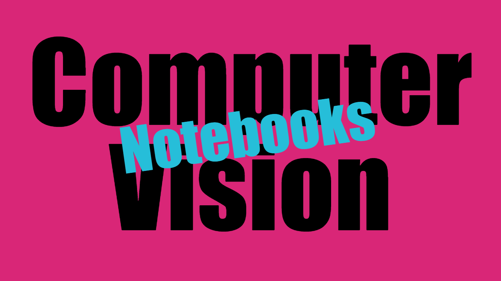

# Computer Vision Notebooks

This is an `authorial collection` of fundamental _python recipes_ in notebook format. I started this project with the sole purpose of helping people to understand **Computer Vision** and **Digital Image Processing** concepts as clearly and succinctly as I could.

In addition, I also developed a bit more appealing way to publish these notebooks, in order to make the experience a little more pleasant and productive. You can check it by visiting the [index page](https://diegoinacio.github.io/computer-vision-notebooks/).

Finally, you can join the [discussion](https://github.com/diegoinacio/computer-vision-notebooks/discussions) section to ask questions and suggest new ideas. And to follow what lies ahead, check out my [python notebook content](https://github.com/users/diegoinacio/projects/6) board.

Created with ❤️ by [Diego Inácio](https://diegoinacio.github.io/)
